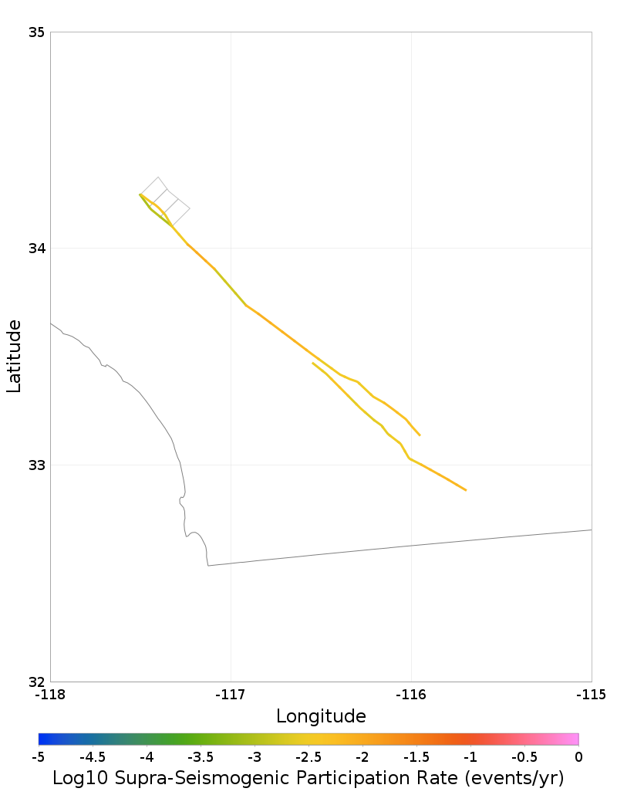
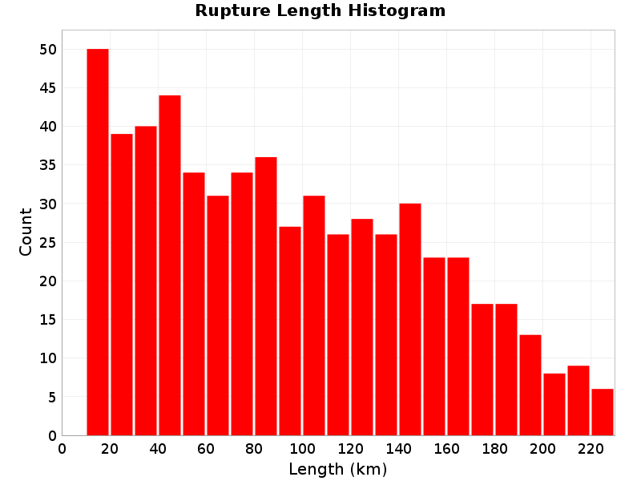
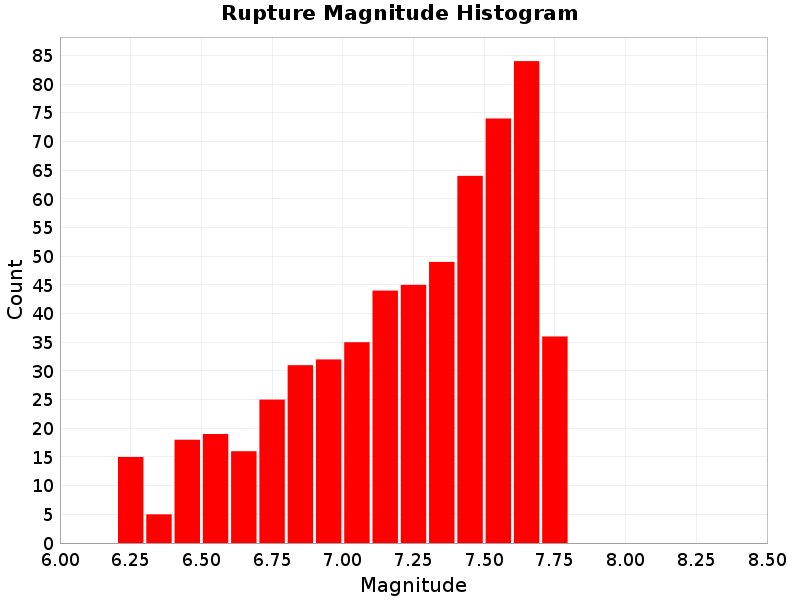
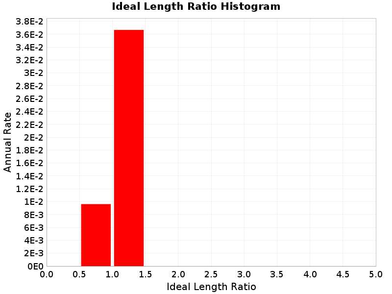
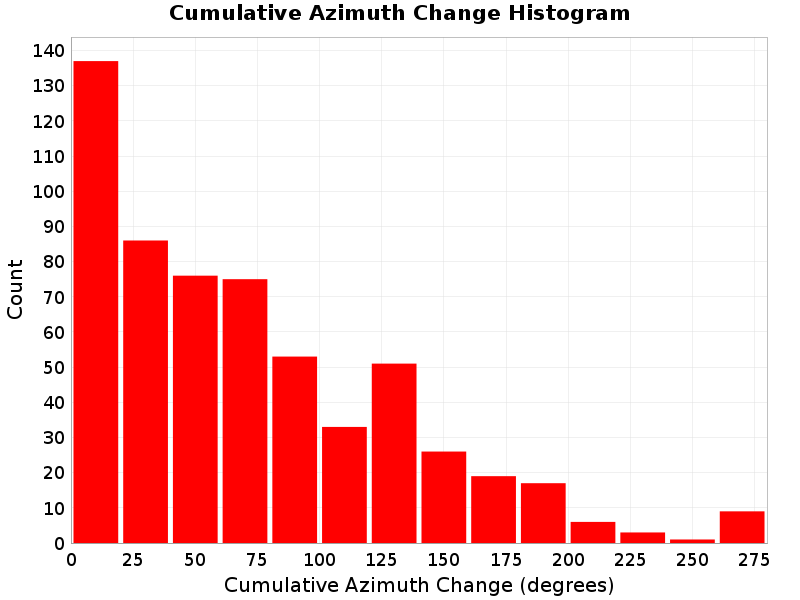
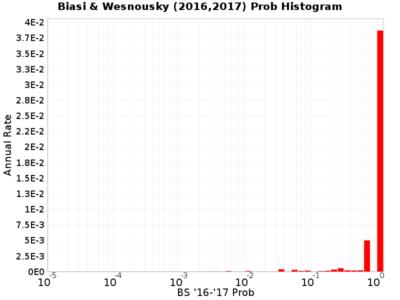
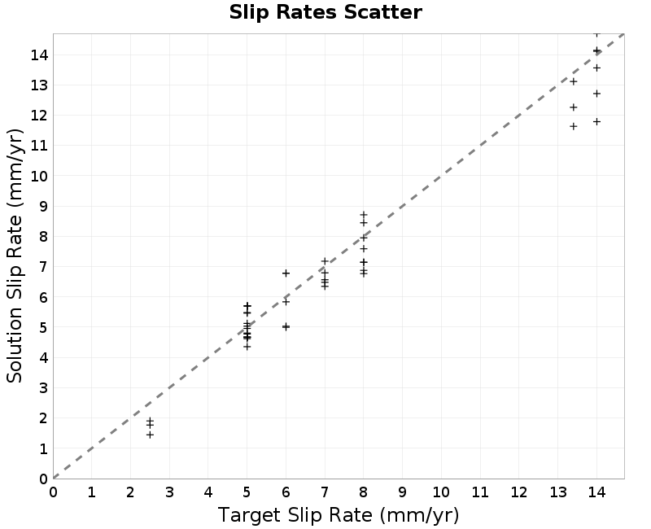
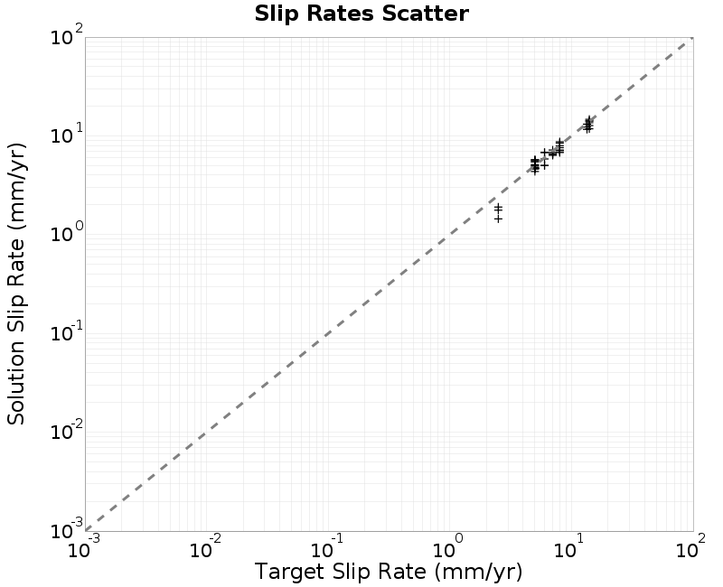
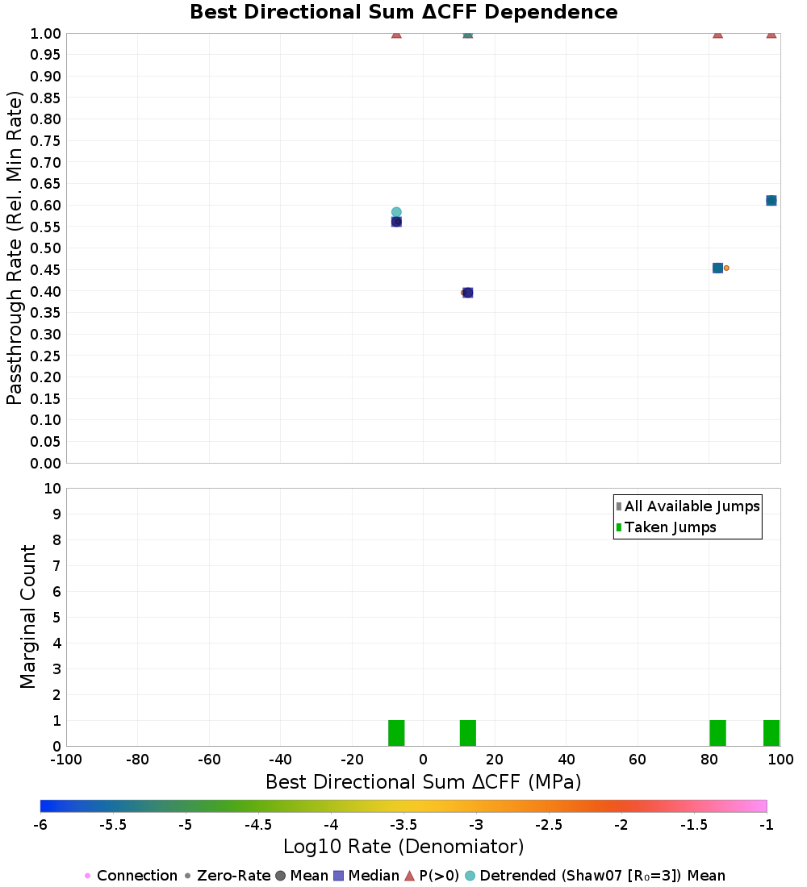

# Solution Report: slip_rate_inferred_gr_solution

| **Num Ruptures** | 592 |
|-----|-----|
| **Num Single-Stranded Ruptures** | 592 (100.00%) |
| **Total Supra-Seis Rupture Rate** | 0.046279725 |
| **Total Supra-Seis Recurrence Interval** | 21.61 yrs |
| **Total Moment Rate** | 1.14992891E18 N-m/yr |
| **Deformation Model Total Moment Rate** | 1.13042508E18 N-m/yr |
| **Magnitude Range** | [6.21,7.77] |
| **Length Range** | [10.52,229.93] km |
| **Rupture Section Count Range** | [2,35] |

## Table Of Contents
* [Solution MFDs](#solution-mfds)
* [Simulated Annealing Energy](#simulated-annealing-energy)
  * [Final Energies](#final-energies)
  * [Energy Progress](#energy-progress)
  * [Rate Distribution](#rate-distribution)
* [Participation Rates](#participation-rates)
* [Plausibility Configuration](#plausibility-configuration)
  * [Connection Strategy](#connection-strategy)
  * [Splays](#splays)
  * [Plausibility Filters](#plausibility-filters)
* [Rupture Scalar Histograms](#rupture-scalar-histograms)
  * [Rupture Length](#rupture-length)
  * [Rupture Magnitude](#rupture-magnitude)
  * [Subsection Count](#subsection-count)
  * [Cluster Count](#cluster-count)
  * [Area](#area)
  * [Maximum Jump Dist](#maximum-jump-dist)
  * [Cumulative Jump Dist](#cumulative-jump-dist)
  * [Ideal Length Ratio](#ideal-length-ratio)
  * [Ideal Length Difference](#ideal-length-difference)
  * [Rake](#rake)
  * [Cumulative Rake Change](#cumulative-rake-change)
  * [Mechanism Change](#mechanism-change)
  * [Cumulative Azimuth Change](#cumulative-azimuth-change)
  * [Biasi & Wesnousky (2016,2017) Prob](#biasi--wesnousky-20162017-prob)
  * [Max Slip Rate Difference](#max-slip-rate-difference)
* [Fault Section Connections](#fault-section-connections)
* [Slip Rates](#slip-rates)
  * [Linear Slip Rate Plots](#linear-slip-rate-plots)
  * [Log10 Slip Rate Plots](#log10-slip-rate-plots)
* [Jump Counts Over Distance](#jump-counts-over-distance)
  * [Supra-seismogenic Jump Counts](#supra-seismogenic-jump-counts)
  * [M&ge;7 Jump Counts](#m7-jump-counts)
* [Fault Segmentation](#fault-segmentation)
  * [Supra-Seismogenic Fault Segmentation](#supra-seismogenic-fault-segmentation)
  * [M&ge;6.5 Fault Segmentation](#m65-fault-segmentation)
  * [M&ge;7.0 Fault Segmentation](#m70-fault-segmentation)
  * [M&ge;7.5 Fault Segmentation](#m75-fault-segmentation)
  * [Magnitude Connection Rate Comparisons](#magnitude-connection-rate-comparisons)
* [Parent Section Detail Pages](#parent-section-detail-pages)
## Solution MFDs
_[(top)](#table-of-contents)_

| Incremental MFDs | Cumulative MFDs |
|-----|-----|
|  |  |

## Simulated Annealing Energy
_[(top)](#table-of-contents)_

* Iterations: 263,155,273 (4,380,300 /sec)
* Time: 1 min 0.1 secs
* Perturbations: 33,637,399
* Total energy: 2.6077128E-5
### Final Energies
_[(top)](#table-of-contents)_

| Energy Type | Final Energy (1 min 0.1 secs) | % of Total |
|-----|-----|-----|
| **Total Energy** | **2.6077128E-5** |  |
| **Equality Energy** | 2.6077128E-5 | 100.00% |
| **Entropy Energy** | 0.0 | 0.00% |
| **Inequality Energy** | 0.0 | 0.00% |
| **Slip Rate** | 2.60673E-5 | 99.96% |
| **MFD Equality** | 9.828281E-9 | 0.04% |

### Energy Progress
_[(top)](#table-of-contents)_

### Rate Distribution
_[(top)](#table-of-contents)_

* Non-zero ruptures: 362 (61.15%)
* Avg. # perturbations per rupture: 56819.93
* Avg. # perturbations per perturbed rupture: 92920.99

## Participation Rates
_[(top)](#table-of-contents)_

| 
**Supra-Seismogenic**
 | 
**Range: M&le;7**
 |
|-----|-----|
|  |  |
|  [Download GeoJSON](resources/sol_partic_supra_seis.geojson) |  [Download GeoJSON](resources/sol_partic_supra_seis_to_m7.geojson) |
| 
**M&ge;7**
 |  |
|  |  |
|  [Download GeoJSON](resources/sol_partic_m7.geojson) |  |

## Plausibility Configuration
_[(top)](#table-of-contents)_

### Connection Strategy
_[(top)](#table-of-contents)_

|   | slip_rate_inferred_gr_solution |
|-----|-----|
| **Name** | ClosestSectPair: maxDist=5 km |
| **Max Jump Dist** | 5 km |
| **Possible parent-section connections** | Total: 18, Avg: 2.00, Range: [1,3] |
| **Actual connections (after applying filters)** | Total: 8, Avg: 1.78, Range: [1,3] |

### Splays
_[(top)](#table-of-contents)_

|   | slip_rate_inferred_gr_solution |
|-----|-----|
| **Max Allowed Splays** | 0 |

### Plausibility Filters
_[(top)](#table-of-contents)_

| slip_rate_inferred_gr_solution |
|-----|
| Cumulative Azimuth ≤560 |
| Cumulative Rake Change ≤180 |
| Jump Azimuth Change Filter |
| Min Sections Per Parent |
| Total Azimuth Change Filter |

## Rupture Scalar Histograms
_[(top)](#table-of-contents)_

### Rupture Length
_[(top)](#table-of-contents)_

Total length (km) of the rupture, not including jumps or gaps.

|  |
|-----|
|  | *N/A* |
|  | *N/A* |
|  |

#### Rupture Length vs Rupture Rate
_[(top)](#table-of-contents)_

|  |  |
|-----|-----|
### Rupture Magnitude
_[(top)](#table-of-contents)_

Magnitude of the rupture.

|  |
|-----|
|  | *N/A* |
|  | *N/A* |
|  |

#### Rupture Magnitude vs Rupture Rate
_[(top)](#table-of-contents)_

|  |  |
|-----|-----|
### Subsection Count
_[(top)](#table-of-contents)_

Total number of subsections involved in a rupture.

|  |
|-----|
|  | *N/A* |
|  | *N/A* |
|  |

#### Subsection Count vs Rupture Rate
_[(top)](#table-of-contents)_

|  |  |
|-----|-----|
### Cluster Count
_[(top)](#table-of-contents)_

Total number of clusters (of contiguous subsections on the same parent fault section) a rupture.

|  |
|-----|
|  | *N/A* |
|  | *N/A* |
|  |

#### Cluster Count vs Rupture Rate
_[(top)](#table-of-contents)_

|  |  |
|-----|-----|
### Area
_[(top)](#table-of-contents)_

Total area of the rupture (km^2).

|  |
|-----|
|  | *N/A* |
|  | *N/A* |
|  |

#### Area vs Rupture Rate
_[(top)](#table-of-contents)_

|  |  |
|-----|-----|
### Maximum Jump Dist
_[(top)](#table-of-contents)_

The maximum jump distance in the rupture.

|  |
|-----|
|  | *N/A* |
|  | *N/A* |
|  |

#### Maximum Jump Dist vs Rupture Rate
_[(top)](#table-of-contents)_

|  |  |
|-----|-----|
### Cumulative Jump Dist
_[(top)](#table-of-contents)_

The total cumulative jump distance summed over all jumps in the rupture.

|  |
|-----|
|  | *N/A* |
|  | *N/A* |
|  |

#### Cumulative Jump Dist vs Rupture Rate
_[(top)](#table-of-contents)_

|  |  |
|-----|-----|
### Ideal Length Ratio
_[(top)](#table-of-contents)_

The ratio between the total length of this rupture and the 'idealized length,' which we define as the straight line distance between the furthest two subsections.

|  |
|-----|
|  | *N/A* |
|  | *N/A* |
|  |

#### Ideal Length Ratio vs Rupture Rate
_[(top)](#table-of-contents)_

|  |  |
|-----|-----|
### Ideal Length Difference
_[(top)](#table-of-contents)_

The difference between the total length of this rupture and the 'idealized length,' which we define as the straight line distance between the furthest two subsections.

|  |
|-----|
|  | *N/A* |
|  | *N/A* |
|  |

#### Ideal Length Difference vs Rupture Rate
_[(top)](#table-of-contents)_

|  |  |
|-----|-----|
### Rake
_[(top)](#table-of-contents)_

The area-averaged rake for this rupture.

|  |
|-----|
|  | *N/A* |
|  | *N/A* |
|  |

#### Rake vs Rupture Rate
_[(top)](#table-of-contents)_

|  |  |
|-----|-----|
### Cumulative Rake Change
_[(top)](#table-of-contents)_

Cumulative rake change for this rupture.

### Mechanism Change
_[(top)](#table-of-contents)_

The number of times a rupture changed mechanisms, e.g., from right-lateral SS to left-lateral or SS to reverse.

|  |
|-----|
|  | *N/A* |
|  | *N/A* |
|  |

#### Mechanism Change vs Rupture Rate
_[(top)](#table-of-contents)_

|  |  |
|-----|-----|
### Cumulative Azimuth Change
_[(top)](#table-of-contents)_

Cumulative azimuth change for this rupture.

|  |
|-----|
|  | *N/A* |
|  | *N/A* |
|  |

#### Cumulative Azimuth Change vs Rupture Rate
_[(top)](#table-of-contents)_

|  |  |
|-----|-----|
### Biasi & Wesnousky (2016,2017) Prob
_[(top)](#table-of-contents)_

Biasi & Wesnousky (2016,2017) conditional probability of passing through each jump.

|  |
|-----|
|  | *N/A* |
|  | *N/A* |
|  |

#### Biasi & Wesnousky (2016,2017) Prob vs Rupture Rate
_[(top)](#table-of-contents)_

|  |  |
|-----|-----|
### Max Slip Rate Difference
_[(top)](#table-of-contents)_

The difference between the slip rate with the highest and lowest slip rate in the rupture.

|  |
|-----|
|  | *N/A* |
|  | *N/A* |
|  |

#### Max Slip Rate Difference vs Rupture Rate
_[(top)](#table-of-contents)_

|  |  |
|-----|-----|

## Fault Section Connections
_[(top)](#table-of-contents)_

|  |
|-----|
|  [Download GeoJSON](resources/sect_connectivity.geojson) | *N/A* |
|  |
|  |
|  |

## Slip Rates
_[(top)](#table-of-contents)_

### Linear Slip Rate Plots
_[(top)](#table-of-contents)_

|  |  |
|-----|-----|
|  [Download GeoJSON](resources/slip_rates_orig.geojson) |  [Download GeoJSON](resources/slip_rates_reduced.geojson) |
|  |  |
|  [Download GeoJSON](resources/slip_rates_target.geojson) |  [Download GeoJSON](resources/slip_rates_sol.geojson) |
|  |  |
|  [Download GeoJSON](resources/slip_rates_sol_diff.geojson) |  [Download GeoJSON](resources/slip_rates_sol_ratio.geojson) |
|  |  |

### Log10 Slip Rate Plots
_[(top)](#table-of-contents)_

|  |  |
|-----|-----|
|  [Download GeoJSON](resources/slip_rates_log_orig.geojson) |  [Download GeoJSON](resources/slip_rates_log_reduced.geojson) |
|  |  |
|  [Download GeoJSON](resources/slip_rates_log_target.geojson) |  [Download GeoJSON](resources/slip_rates_log_sol.geojson) |
|  |  |
|  [Download GeoJSON](resources/slip_rates_log_sol_ratio.geojson) |  |

## Jump Counts Over Distance
_[(top)](#table-of-contents)_

### Supra-seismogenic Jump Counts
_[(top)](#table-of-contents)_

| As Discretized | Rate Weighted |
|-----|-----|
|  |  |
|  |  |
|  |  |

### M&ge;7 Jump Counts
_[(top)](#table-of-contents)_

| As Discretized | Rate Weighted |
|-----|-----|
|  |  |
|  |  |
|  |  |

## Fault Segmentation
_[(top)](#table-of-contents)_

The following plots show implied segmentation from the rates of this fault system solution.

### Supra-Seismogenic Fault Segmentation
_[(top)](#table-of-contents)_

**Connection Rates**

This shows the rate at which each connection is taken.

**Connection Passthrough Rates**

_[(top)](#table-of-contents)_

Passthrough rates refer to the ratio of the jumping rate to the rates on either side of the jump. The denominator of that ratio can be either the minimum, maximum, or average of the subsection rates on either side of the jump. Each choice of denomiator is plotted separately.

|  |
|-----|

**Connection Passthrough Rates vs Scalars**

_[(top)](#table-of-contents)_

This plots passthrough rates versus various scalar values (for each rate combiniation type).

| Jump Distance (km) | Jump Distance (km) (Log10 Rates) |
|-----|-----|
|  |  |

| \|Slip Rate Change\| (mm/yr) | \|Slip Rate Change\| (mm/yr) (Log10 Rates) |
|-----|-----|
|  |  |

| Slip Rate Ratio (mm/yr) | Slip Rate Ratio (mm/yr) (Log10 Rates) |
|-----|-----|
|  |  |

| \|Dip Change\| (degrees) | \|Dip Change\| (degrees) (Log10 Rates) |
|-----|-----|
|  |  |

| \|Rake Change\| (degrees) | \|Rake Change\| (degrees) (Log10 Rates) |
|-----|-----|
|  |  |

| \|Azimuth Change\| (degrees) | \|Azimuth Change\| (degrees) (Log10 Rates) |
|-----|-----|
|  |  |

| Best Directional Fract ΔCFF>0 | Best Directional Fract ΔCFF>0 (Log10 Rates) |
|-----|-----|
|  |  |

| Best Directional Fract RPatch ΔCFF>0 | Best Directional Fract RPatch ΔCFF>0 (Log10 Rates) |
|-----|-----|
|  |  |

| Best Directional Sum ΔCFF (MPa) | Best Directional Sum ΔCFF (MPa) (Log10 Rates) |
|-----|-----|
|  |  |

| Max ΔCFF (MPa) | Max ΔCFF (MPa) (Log10 Rates) |
|-----|-----|
|  |  |

### M&ge;6.5 Fault Segmentation
_[(top)](#table-of-contents)_

**Connection Rates**

This shows the rate at which each connection is taken.

**Connection Passthrough Rates**

_[(top)](#table-of-contents)_

Passthrough rates refer to the ratio of the jumping rate to the rates on either side of the jump. The denominator of that ratio can be either the minimum, maximum, or average of the subsection rates on either side of the jump. Each choice of denomiator is plotted separately.

|  |
|-----|

**Connection Passthrough Rates vs Scalars**

_[(top)](#table-of-contents)_

This plots passthrough rates versus various scalar values (for each rate combiniation type).

| Jump Distance (km) | Jump Distance (km) (Log10 Rates) |
|-----|-----|
|  |  |

| \|Slip Rate Change\| (mm/yr) | \|Slip Rate Change\| (mm/yr) (Log10 Rates) |
|-----|-----|
|  |  |

| Slip Rate Ratio (mm/yr) | Slip Rate Ratio (mm/yr) (Log10 Rates) |
|-----|-----|
|  |  |

| \|Dip Change\| (degrees) | \|Dip Change\| (degrees) (Log10 Rates) |
|-----|-----|
|  |  |

| \|Rake Change\| (degrees) | \|Rake Change\| (degrees) (Log10 Rates) |
|-----|-----|
|  |  |

| \|Azimuth Change\| (degrees) | \|Azimuth Change\| (degrees) (Log10 Rates) |
|-----|-----|
|  |  |

| Best Directional Fract ΔCFF>0 | Best Directional Fract ΔCFF>0 (Log10 Rates) |
|-----|-----|
|  |  |

| Best Directional Fract RPatch ΔCFF>0 | Best Directional Fract RPatch ΔCFF>0 (Log10 Rates) |
|-----|-----|
|  |  |

| Best Directional Sum ΔCFF (MPa) | Best Directional Sum ΔCFF (MPa) (Log10 Rates) |
|-----|-----|
|  |  |

| Max ΔCFF (MPa) | Max ΔCFF (MPa) (Log10 Rates) |
|-----|-----|
|  |  |

### M&ge;7.0 Fault Segmentation
_[(top)](#table-of-contents)_

**Connection Rates**

This shows the rate at which each connection is taken.

**Connection Passthrough Rates**

_[(top)](#table-of-contents)_

Passthrough rates refer to the ratio of the jumping rate to the rates on either side of the jump. The denominator of that ratio can be either the minimum, maximum, or average of the subsection rates on either side of the jump. Each choice of denomiator is plotted separately.

|  |
|-----|

**Connection Passthrough Rates vs Scalars**

_[(top)](#table-of-contents)_

This plots passthrough rates versus various scalar values (for each rate combiniation type).

| Jump Distance (km) | Jump Distance (km) (Log10 Rates) |
|-----|-----|
|  |  |

| \|Slip Rate Change\| (mm/yr) | \|Slip Rate Change\| (mm/yr) (Log10 Rates) |
|-----|-----|
|  |  |

| Slip Rate Ratio (mm/yr) | Slip Rate Ratio (mm/yr) (Log10 Rates) |
|-----|-----|
|  |  |

| \|Dip Change\| (degrees) | \|Dip Change\| (degrees) (Log10 Rates) |
|-----|-----|
|  |  |

| \|Rake Change\| (degrees) | \|Rake Change\| (degrees) (Log10 Rates) |
|-----|-----|
|  |  |

| \|Azimuth Change\| (degrees) | \|Azimuth Change\| (degrees) (Log10 Rates) |
|-----|-----|
|  |  |

| Best Directional Fract ΔCFF>0 | Best Directional Fract ΔCFF>0 (Log10 Rates) |
|-----|-----|
|  |  |

| Best Directional Fract RPatch ΔCFF>0 | Best Directional Fract RPatch ΔCFF>0 (Log10 Rates) |
|-----|-----|
|  |  |

| Best Directional Sum ΔCFF (MPa) | Best Directional Sum ΔCFF (MPa) (Log10 Rates) |
|-----|-----|
|  |  |

| Max ΔCFF (MPa) | Max ΔCFF (MPa) (Log10 Rates) |
|-----|-----|
|  |  |

### M&ge;7.5 Fault Segmentation
_[(top)](#table-of-contents)_

**Connection Rates**

This shows the rate at which each connection is taken.

**Connection Passthrough Rates**

_[(top)](#table-of-contents)_

Passthrough rates refer to the ratio of the jumping rate to the rates on either side of the jump. The denominator of that ratio can be either the minimum, maximum, or average of the subsection rates on either side of the jump. Each choice of denomiator is plotted separately.

|  |
|-----|

**Connection Passthrough Rates vs Scalars**

_[(top)](#table-of-contents)_

This plots passthrough rates versus various scalar values (for each rate combiniation type).

| Jump Distance (km) | Jump Distance (km) (Log10 Rates) |
|-----|-----|
|  |  |

| \|Slip Rate Change\| (mm/yr) | \|Slip Rate Change\| (mm/yr) (Log10 Rates) |
|-----|-----|
|  |  |

| Slip Rate Ratio (mm/yr) | Slip Rate Ratio (mm/yr) (Log10 Rates) |
|-----|-----|
|  |  |

| \|Dip Change\| (degrees) | \|Dip Change\| (degrees) (Log10 Rates) |
|-----|-----|
|  |  |

| \|Rake Change\| (degrees) | \|Rake Change\| (degrees) (Log10 Rates) |
|-----|-----|
|  |  |

| \|Azimuth Change\| (degrees) | \|Azimuth Change\| (degrees) (Log10 Rates) |
|-----|-----|
|  |  |

| Best Directional Fract ΔCFF>0 | Best Directional Fract ΔCFF>0 (Log10 Rates) |
|-----|-----|
|  |  |

| Best Directional Fract RPatch ΔCFF>0 | Best Directional Fract RPatch ΔCFF>0 (Log10 Rates) |
|-----|-----|
|  |  |

| Best Directional Sum ΔCFF (MPa) | Best Directional Sum ΔCFF (MPa) (Log10 Rates) |
|-----|-----|
|  |  |

| Max ΔCFF (MPa) | Max ΔCFF (MPa) (Log10 Rates) |
|-----|-----|
|  |  |

### Magnitude Connection Rate Comparisons
_[(top)](#table-of-contents)_

This comapres slip_rate_inferred_gr_solution passthrough rates across magniutdes (and also for each rate combiniation type). Linear on the left, log10 on the right.

| Linear Passthrough Rates | Log10 Passthrough Rates |
|-----|-----|
|  |  |
|  |  |
|  |  |
|  |  |
|  |  |
|  |  |

## Parent Section Detail Pages
_[(top)](#table-of-contents)_

| Fault Section |
|-----|
| [Lytle Creek (San Jacinto, connector)](resources/../parent_sect_pages/Lytle_Creek_San_Jacinto_connector) |
| [San Jacinto (Anza)](resources/../parent_sect_pages/San_Jacinto_Anza) |
| [San Jacinto (Borrego)](resources/../parent_sect_pages/San_Jacinto_Borrego) |
| [San Jacinto (Clark)](resources/../parent_sect_pages/San_Jacinto_Clark) |
| [San Jacinto (Coyote Creek)](resources/../parent_sect_pages/San_Jacinto_Coyote_Creek) |
| [San Jacinto (San Bernardino)](resources/../parent_sect_pages/San_Jacinto_San_Bernardino) |
| [San Jacinto (San Jacinto Valley)](resources/../parent_sect_pages/San_Jacinto_San_Jacinto_Valley) |
| [San Jacinto (Superstition Mountain)](resources/../parent_sect_pages/San_Jacinto_Superstition_Mountain) |
| [San Jacinto (stepover)](resources/../parent_sect_pages/San_Jacinto_stepover) |

