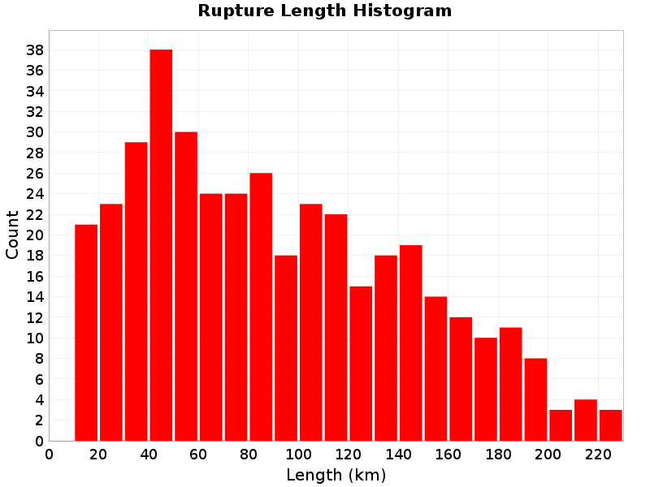

# San Jacinto (Anza) Details

| _Property_ | _Value_ |
|-----|-----|
| **Rupture Count** | 395 |
| **Magnitude Range** | [6.48, 7.77] |
| **Length Range** | [15, 230] km |
| **Total Rate** | 0.010922924 /yr |
| **Multi-Fault Rate** | 0.0039126105 /yr (35.82%) |
| **Directly-Connected Faults** | 3 |
| **All Co-Rupturing Faults** | 8 |

## Table Of Contents
* [Magnitude-Frequency Distribution](#magnitude-frequency-distribution)
* [Along-Strike Values](#along-strike-values)
* [Scalar Histograms & Example Ruptures](#scalar-histograms--example-ruptures)
  * [Rupture Magnitude](#rupture-magnitude)
  * [Rupture Length](#rupture-length)
  * [Cumulative Jump Dist](#cumulative-jump-dist)
* [Connectivity](#connectivity)
  * [Nearby Sections](#nearby-sections)

## Magnitude-Frequency Distribution
_[(top)](#table-of-contents)_

| Incremental | Cumulative |
|-----|-----|
|  |  |

## Along-Strike Values
_[(top)](#table-of-contents)_

## Scalar Histograms & Example Ruptures
_[(top)](#table-of-contents)_

### Rupture Magnitude
_[(top)](#table-of-contents)_

| **Minimum: 6.48** | **p50: 7.49** | **p90: 7.7** | **p95: 7.72** |
|-----|-----|-----|-----|
|  |  |  |  |
| **p97.5: 7.74** | **p99: 7.76** | **p99.9: 7.77** | **Maximum: 7.77** |
|  |  |  |  |

### Rupture Length
_[(top)](#table-of-contents)_

| **Minimum: 15.39** | **p50: 120.22** | **p90: 186.68** | **p95: 203.64** |
|-----|-----|-----|-----|
|  |  |  |  |
| **p97.5: 215.64** | **p99: 222.65** | **p99.9: 229.93** | **Maximum: 229.93** |
|  |  |  |  |

### Cumulative Jump Dist
_[(top)](#table-of-contents)_

| **Minimum: 0.0** | **p50: 3.49** | **p90: 3.49** | **p95: 3.61** |
|-----|-----|-----|-----|
|  |  |  |  |
| **p97.5: 3.61** | **p99: 3.61** | **p99.9: 3.61** | **Maximum: 3.61** |
|  |  |  |  |

## Connectivity
_[(top)](#table-of-contents)_

|  |  |
|-----|-----|

### Nearby Sections
_[(top)](#table-of-contents)_

| Fault Section |
|-----|
| [**San Jacinto (stepover), 0 km away**](#san-jacinto-stepover-0-km-away) |
| [**San Jacinto (Clark), 0 km away**](#san-jacinto-clark-0-km-away) |
| [**San Jacinto (Coyote Creek), 3.49 km away**](#san-jacinto-coyote-creek-349-km-away) |

#### San Jacinto (stepover), 0 km away
[_(back to table)_](#nearby-sections)

|  | slip_rate_inferred_gr_seg_solution |
|-----|-----|
| **Connected?** | true |
| **Directly Connected?** | true |
| **Co-rupture Count** | 270 |
| **Co-rupture Rate** | 0.00146123 |
#### San Jacinto (Clark), 0 km away
[_(back to table)_](#nearby-sections)

|  | slip_rate_inferred_gr_seg_solution |
|-----|-----|
| **Connected?** | true |
| **Directly Connected?** | true |
| **Co-rupture Count** | 105 |
| **Co-rupture Rate** | 0.002980046 |
#### San Jacinto (Coyote Creek), 3.49 km away
[_(back to table)_](#nearby-sections)

|  | slip_rate_inferred_gr_seg_solution |
|-----|-----|
| **Connected?** | true |
| **Directly Connected?** | true |
| **Co-rupture Count** | 225 |
| **Co-rupture Rate** | 5.1807263E-4 |
