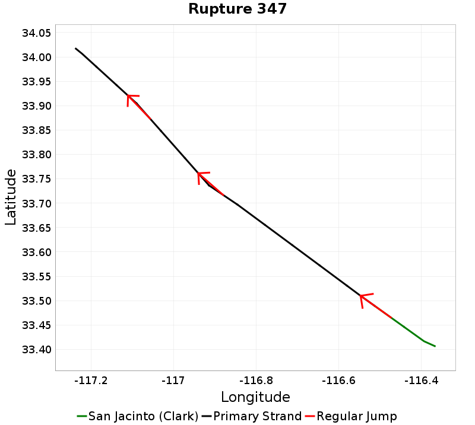

# San Jacinto (Clark) Details

| _Property_ | _Value_ |
|-----|-----|
| **Rupture Count** | 133 |
| **Magnitude Range** | [6.51, 7.74] |
| **Length Range** | [16, 192] km |
| **Total Rate** | 0.007879929 /yr |
| **Multi-Fault Rate** | 0.002980046 /yr (37.82%) |
| **Directly-Connected Faults** | 1 |
| **All Co-Rupturing Faults** | 5 |

## Table Of Contents
* [Magnitude-Frequency Distribution](#magnitude-frequency-distribution)
* [Along-Strike Values](#along-strike-values)
* [Scalar Histograms & Example Ruptures](#scalar-histograms--example-ruptures)
  * [Rupture Magnitude](#rupture-magnitude)
  * [Rupture Length](#rupture-length)
  * [Cumulative Jump Dist](#cumulative-jump-dist)
* [Connectivity](#connectivity)
  * [Nearby Sections](#nearby-sections)

## Magnitude-Frequency Distribution
_[(top)](#table-of-contents)_

| Incremental | Cumulative |
|-----|-----|
|  |  |

## Along-Strike Values
_[(top)](#table-of-contents)_

## Scalar Histograms & Example Ruptures
_[(top)](#table-of-contents)_

### Rupture Magnitude
_[(top)](#table-of-contents)_

| **Minimum: 6.51** | **p50: 7.45** | **p90: 7.68** | **p95: 7.7** |
|-----|-----|-----|-----|
|  |  |  |  |
| **p97.5: 7.72** | **p99: 7.73** | **p99.9: 7.74** | **Maximum: 7.74** |
|  |  |  |  |

### Rupture Length
_[(top)](#table-of-contents)_

| **Minimum: 16.44** | **p50: 103.74** | **p90: 167.98** | **p95: 176.34** |
|-----|-----|-----|-----|
|  |  |  |  |
| **p97.5: 184.03** | **p99: 190.23** | **p99.9: 192.25** | **Maximum: 192.25** |
|  |  |  |  |

### Cumulative Jump Dist
_[(top)](#table-of-contents)_

| **Minimum: 0.0** | **p50: 2.8292956E-12** | **p90: 0.12** | **p95: 0.12** |
|-----|-----|-----|-----|
|  |  |  |  |
| **p97.5: 0.12** | **p99: 0.12** | **p99.9: 0.12** | **Maximum: 0.12** |
|  |  |  |  |

## Connectivity
_[(top)](#table-of-contents)_

|  |  |
|-----|-----|

### Nearby Sections
_[(top)](#table-of-contents)_

| Fault Section |
|-----|
| [**San Jacinto (Anza), 0 km away**](#san-jacinto-anza-0-km-away) |
| [San Jacinto (Coyote Creek), 3.52 km away](#san-jacinto-coyote-creek-352-km-away) |

#### San Jacinto (Anza), 0 km away
[_(back to table)_](#nearby-sections)

|  | slip_rate_inferred_gr_seg_solution |
|-----|-----|
| **Connected?** | true |
| **Directly Connected?** | true |
| **Co-rupture Count** | 105 |
| **Co-rupture Rate** | 0.002980046 |
#### San Jacinto (Coyote Creek), 3.52 km away
[_(back to table)_](#nearby-sections)

|  | slip_rate_inferred_gr_seg_solution |
|-----|-----|
| **Connected?** | false |
| **Directly Connected?** | false |
| **Co-rupture Count** | 0 |
| **Co-rupture Rate** | _N/A_ |
