# Rupture Set Report: azimuthal_rup_set

| **Num Ruptures** | 592 |
|-----|-----|
| **Num Single-Stranded Ruptures** | 592 (100.00%) |
| **Deformation Model Total Moment Rate** | 1.13042508E18 N-m/yr |
| **Magnitude Range** | [6.21,7.77] |
| **Length Range** | [10.52,229.93] km |
| **Rupture Section Count Range** | [2,35] |

## Table Of Contents
* [Plausibility Configuration](#plausibility-configuration)
  * [Connection Strategy](#connection-strategy)
  * [Splays](#splays)
  * [Plausibility Filters](#plausibility-filters)
* [Rupture Scalar Histograms](#rupture-scalar-histograms)
  * [Rupture Length](#rupture-length)
  * [Rupture Magnitude](#rupture-magnitude)
  * [Subsection Count](#subsection-count)
  * [Cluster Count](#cluster-count)
  * [Area](#area)
  * [Maximum Jump Dist](#maximum-jump-dist)
  * [Cumulative Jump Dist](#cumulative-jump-dist)
  * [Ideal Length Ratio](#ideal-length-ratio)
  * [Ideal Length Difference](#ideal-length-difference)
  * [Rake](#rake)
  * [Cumulative Rake Change](#cumulative-rake-change)
  * [Mechanism Change](#mechanism-change)
  * [Cumulative Azimuth Change](#cumulative-azimuth-change)
  * [Biasi & Wesnousky (2016,2017) Prob](#biasi--wesnousky-20162017-prob)
  * [Max Slip Rate Difference](#max-slip-rate-difference)
* [Fault Section Connections](#fault-section-connections)
* [Jump Counts Over Distance](#jump-counts-over-distance)
  * [Supra-seismogenic Jump Counts](#supra-seismogenic-jump-counts)
  * [M&ge;7 Jump Counts](#m7-jump-counts)
* [Subsection Maximum Values](#subsection-maximum-values)
  * [Subsection Maximum Rupture Length](#subsection-maximum-rupture-length)
  * [Subsection Maximum Rupture Magnitude](#subsection-maximum-rupture-magnitude)
  * [Subsection Maximum Cumulative Jump Dist](#subsection-maximum-cumulative-jump-dist)
  * [Subsection Maximum Cumulative Rake Change](#subsection-maximum-cumulative-rake-change)
  * [Subsection Maximum Cumulative Azimuth Change](#subsection-maximum-cumulative-azimuth-change)
## Plausibility Configuration
_[(top)](#table-of-contents)_

### Connection Strategy
_[(top)](#table-of-contents)_

|   | azimuthal_rup_set |
|-----|-----|
| **Name** | ClosestSectPair: maxDist=5 km |
| **Max Jump Dist** | 5 km |
| **Possible parent-section connections** | Total: 18, Avg: 2.00, Range: [1,3] |
| **Actual connections (after applying filters)** | Total: 8, Avg: 1.78, Range: [1,3] |

### Splays
_[(top)](#table-of-contents)_

|   | azimuthal_rup_set |
|-----|-----|
| **Max Allowed Splays** | 0 |

### Plausibility Filters
_[(top)](#table-of-contents)_

| azimuthal_rup_set |
|-----|
| Cumulative Azimuth ≤560 |
| Cumulative Rake Change ≤180 |
| Jump Azimuth Change Filter |
| Min Sections Per Parent |
| Total Azimuth Change Filter |

## Rupture Scalar Histograms
_[(top)](#table-of-contents)_

### Rupture Length
_[(top)](#table-of-contents)_

Total length (km) of the rupture, not including jumps or gaps.

|  |
|-----|
|  |

#### Rupture Length Extremes & Examples
_[(top)](#table-of-contents)_

Example ruptures at various percentiles of Rupture Length

| **Minimum: 10.52** | **p50: 87.34** | **p90: 176.17** | **p95: 192.84** |
|-----|-----|-----|-----|
|  | [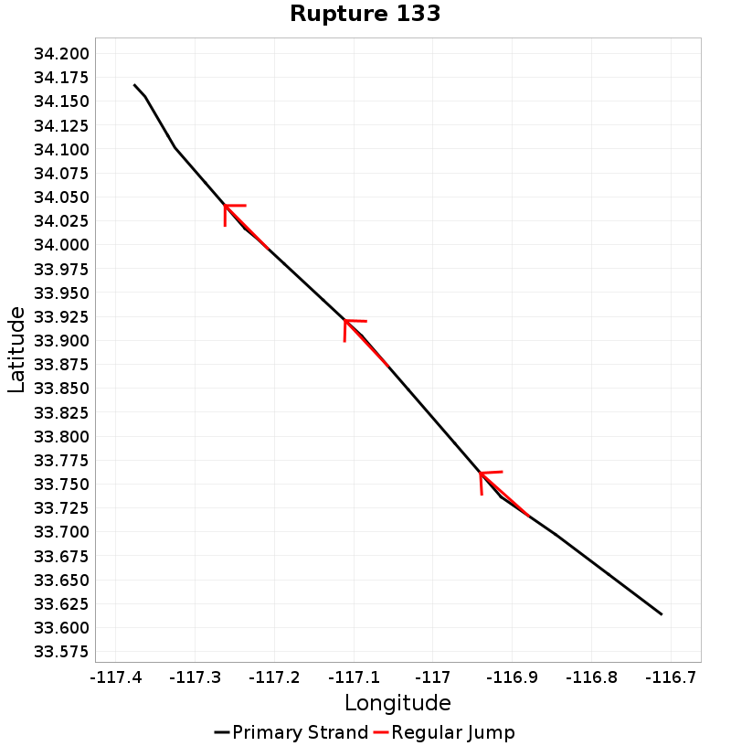](resources/../hist_rup_pages/hist_rup_133.html) |  |  |
| **p97.5: 210.38** | **p99: 220.9** | **p99.9: 229.93** | **Maximum: 229.93** |
|  |  |  |  |

### Rupture Magnitude
_[(top)](#table-of-contents)_

Magnitude of the rupture.

|  |
|-----|
|  |

#### Rupture Magnitude Extremes & Examples
_[(top)](#table-of-contents)_

Example ruptures at various percentiles of Rupture Magnitude

| **Minimum: 6.21** | **p50: 7.32** | **p90: 7.67** | **p95: 7.71** |
|-----|-----|-----|-----|
|  | [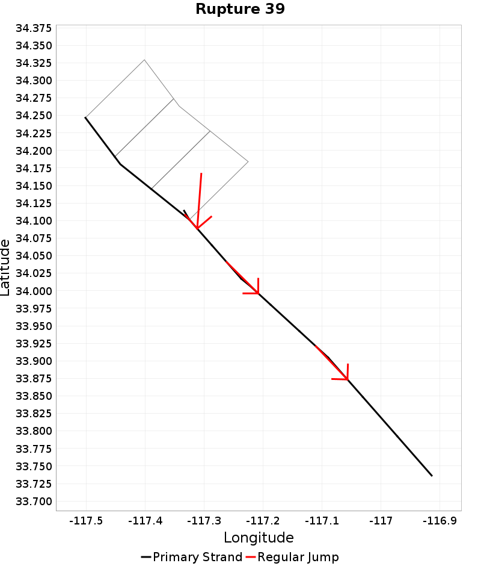](resources/../hist_rup_pages/hist_rup_39.html) |  |  |
| **p97.5: 7.73** | **p99: 7.75** | **p99.9: 7.77** | **Maximum: 7.77** |
|  |  |  |  |

### Subsection Count
_[(top)](#table-of-contents)_

Total number of subsections involved in a rupture.

|  |
|-----|
| 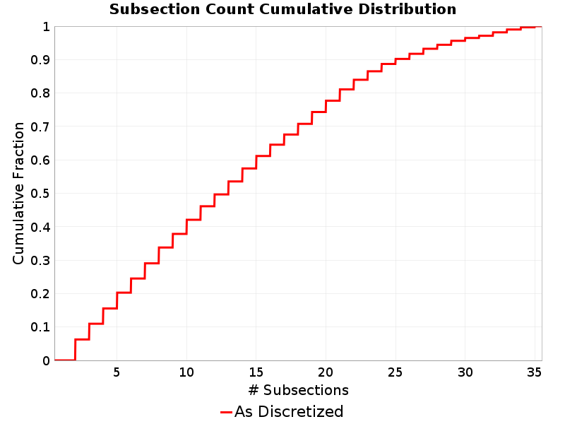 |

#### Subsection Count Extremes & Examples
_[(top)](#table-of-contents)_

Example ruptures at various percentiles of Subsection Count

| **Minimum: 2** | **p50: 13** | **p90: 25** | **p95: 29** |
|-----|-----|-----|-----|
|  |  |  |  |
| **p97.5: 32** | **p99: 34** | **p99.9: 35** | **Maximum: 35** |
| [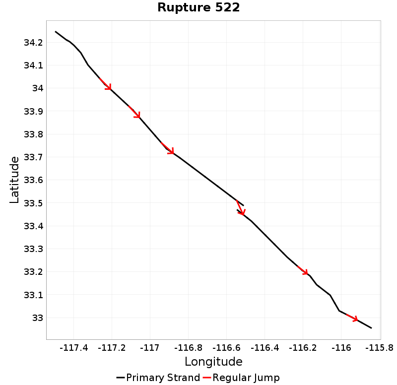](resources/../hist_rup_pages/hist_rup_522.html) |  |  |  |

### Cluster Count
_[(top)](#table-of-contents)_

Total number of clusters (of contiguous subsections on the same parent fault section) a rupture.

|  |
|-----|
|  |

#### Cluster Count Extremes & Examples
_[(top)](#table-of-contents)_

Example ruptures at various percentiles of Cluster Count

| **Minimum: 1** | **p50: 3** | **p90: 6** | **p95: 7** |
|-----|-----|-----|-----|
|  | [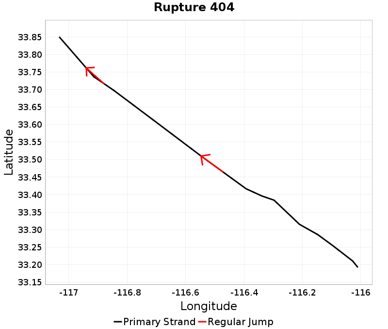](resources/../hist_rup_pages/hist_rup_404.html) | [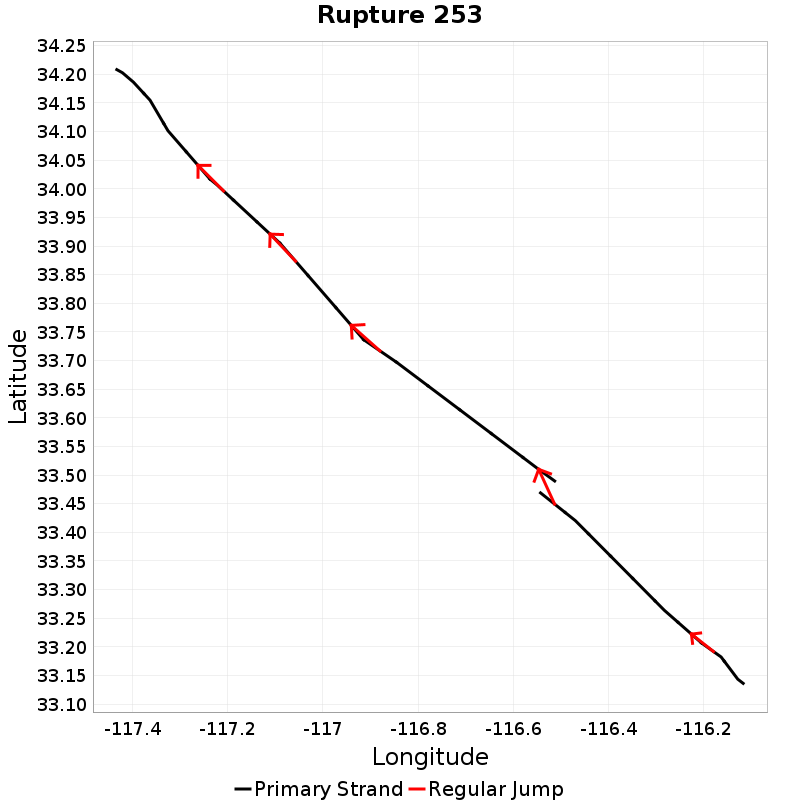](resources/../hist_rup_pages/hist_rup_253.html) |  |
| **p97.5: 7** | **p99: 8** | **p99.9: 8** | **Maximum: 8** |
|  |  |  |  |

### Area
_[(top)](#table-of-contents)_

Total area of the rupture (km^2).

| 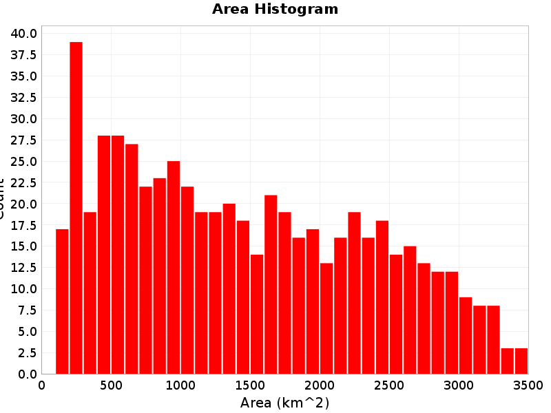 |
|-----|
|  |

#### Area Extremes & Examples
_[(top)](#table-of-contents)_

Example ruptures at various percentiles of Area

| **Minimum: 137.79** | **p50: 1346.02** | **p90: 2765** | **p95: 3008.08** |
|-----|-----|-----|-----|
|  |  |  |  |
| **p97.5: 3182.84** | **p99: 3339.79** | **p99.9: 3493.89** | **Maximum: 3493.89** |
|  |  |  |  |

### Maximum Jump Dist
_[(top)](#table-of-contents)_

The maximum jump distance in the rupture.

|  |
|-----|
|  |

#### Maximum Jump Dist Extremes & Examples
_[(top)](#table-of-contents)_

Example ruptures at various percentiles of Maximum Jump Dist

| **Minimum: 0.0** | **p50: 2.4760012E-12** | **p90: 3.49** | **p95: 3.49** |
|-----|-----|-----|-----|
|  |  |  |  |
| **p97.5: 3.49** | **p99: 3.49** | **p99.9: 3.49** | **Maximum: 3.49** |
|  |  |  |  |

### Cumulative Jump Dist
_[(top)](#table-of-contents)_

The total cumulative jump distance summed over all jumps in the rupture.

|  |
|-----|
|  |

#### Cumulative Jump Dist Extremes & Examples
_[(top)](#table-of-contents)_

Example ruptures at various percentiles of Cumulative Jump Dist

| **Minimum: 0.0** | **p50: 2.8292956E-12** | **p90: 3.49** | **p95: 3.61** |
|-----|-----|-----|-----|
|  |  |  |  |
| **p97.5: 3.61** | **p99: 3.61** | **p99.9: 3.61** | **Maximum: 3.61** |
|  |  |  |  |

### Ideal Length Ratio
_[(top)](#table-of-contents)_

The ratio between the total length of this rupture and the 'idealized length,' which we define as the straight line distance between the furthest two subsections.

|  |
|-----|
|  |

#### Ideal Length Ratio Extremes & Examples
_[(top)](#table-of-contents)_

Example ruptures at various percentiles of Ideal Length Ratio

| **Minimum: 1** | **p50: 1.01** | **p90: 1.02** | **p95: 1.02** |
|-----|-----|-----|-----|
|  | [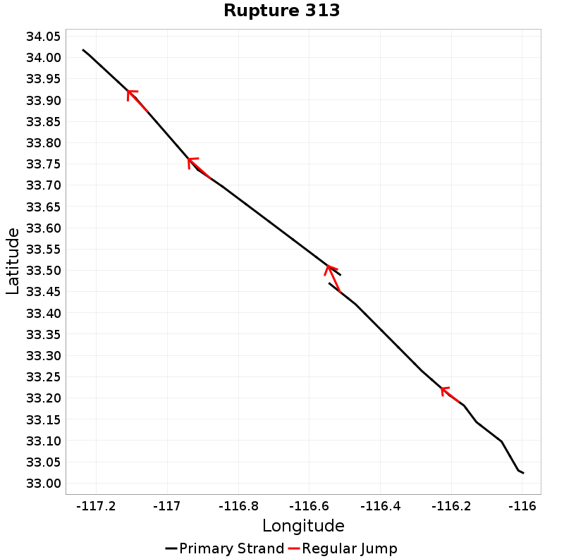](resources/../hist_rup_pages/hist_rup_313.html) |  |  |
| **p97.5: 1.03** | **p99: 1.04** | **p99.9: 1.06** | **Maximum: 1.06** |
|  |  |  |  |

### Ideal Length Difference
_[(top)](#table-of-contents)_

The difference between the total length of this rupture and the 'idealized length,' which we define as the straight line distance between the furthest two subsections.

|  |
|-----|
|  |

#### Ideal Length Difference Extremes & Examples
_[(top)](#table-of-contents)_

Example ruptures at various percentiles of Ideal Length Difference

| **Minimum: -9.944996E-6** | **p50: 0.92** | **p90: 2.43** | **p95: 2.86** |
|-----|-----|-----|-----|
|  |  |  |  |
| **p97.5: 3.19** | **p99: 4** | **p99.9: 4.4** | **Maximum: 4.4** |
|  |  |  |  |

### Rake
_[(top)](#table-of-contents)_

The area-averaged rake for this rupture.

|  |
|-----|
|  |

### Cumulative Rake Change
_[(top)](#table-of-contents)_

Cumulative rake change for this rupture.

### Mechanism Change
_[(top)](#table-of-contents)_

The number of times a rupture changed mechanisms, e.g., from right-lateral SS to left-lateral or SS to reverse.

|  |
|-----|
|  |

#### Mechanism Change Extremes & Examples
_[(top)](#table-of-contents)_

Example ruptures at various percentiles of Mechanism Change

| **Minimum: 0.0** | **p50: 0.0** | **p90: 1** | **p95: 1** |
|-----|-----|-----|-----|
|  |  |  |  |
| **p97.5: 1** | **p99: 1** | **p99.9: 1** | **Maximum: 1** |
| [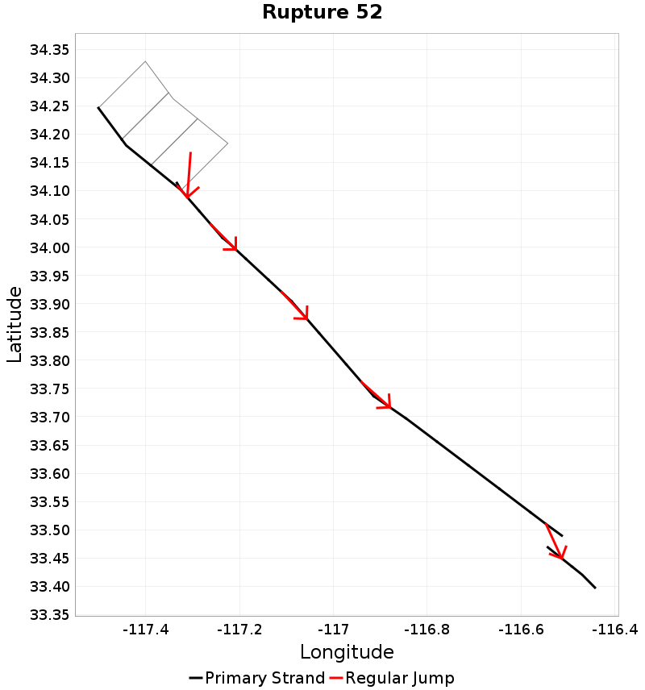](resources/../hist_rup_pages/hist_rup_52.html) |  |  |  |

### Cumulative Azimuth Change
_[(top)](#table-of-contents)_

Cumulative azimuth change for this rupture.

|  |
|-----|
|  |

#### Cumulative Azimuth Change Extremes & Examples
_[(top)](#table-of-contents)_

Example ruptures at various percentiles of Cumulative Azimuth Change

| **Minimum: 0.0** | **p50: 59.78** | **p90: 155.45** | **p95: 187.55** |
|-----|-----|-----|-----|
|  |  |  |  |
| **p97.5: 213.1** | **p99: 261.83** | **p99.9: 271.84** | **Maximum: 271.84** |
|  |  |  |  |

### Biasi & Wesnousky (2016,2017) Prob
_[(top)](#table-of-contents)_

Biasi & Wesnousky (2016,2017) conditional probability of passing through each jump.

|  |
|-----|
|  |

#### Biasi & Wesnousky (2016,2017) Prob Extremes & Examples
_[(top)](#table-of-contents)_

Example ruptures at various percentiles of Biasi & Wesnousky (2016,2017) Prob

| **Maximum: 1** | **p50: 0.33** | **p10: 0.03891892** | **p5: 0.0053239716** |
|-----|-----|-----|-----|
|  | [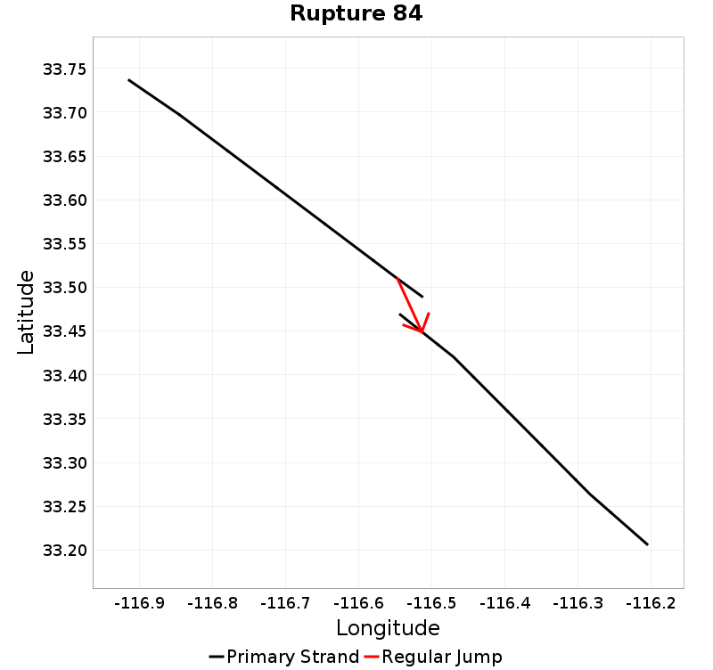](resources/../hist_rup_pages/hist_rup_84.html) |  |  |
| **p2.5: 0.0038850603** | **p1: 0.002835044** | **p0.1: 0.002835044** | **Minimum: 0.002835044** |
|  |  |  |  |

### Max Slip Rate Difference
_[(top)](#table-of-contents)_

The difference between the slip rate with the highest and lowest slip rate in the rupture.

|  |
|-----|
|  |

#### Max Slip Rate Difference Extremes & Examples
_[(top)](#table-of-contents)_

Example ruptures at various percentiles of Max Slip Rate Difference

| **Minimum: 0.0** | **p50: 9** | **p90: 10.9** | **p95: 11.5** |
|-----|-----|-----|-----|
|  |  |  |  |
| **p97.5: 11.5** | **p99: 11.5** | **p99.9: 11.5** | **Maximum: 11.5** |
|  |  |  |  |

## Fault Section Connections
_[(top)](#table-of-contents)_

|  |
|-----|
|  [Download GeoJSON](resources/sect_connectivity.geojson) | *N/A* |
|  |

## Jump Counts Over Distance
_[(top)](#table-of-contents)_

### Supra-seismogenic Jump Counts
_[(top)](#table-of-contents)_

|  |
|-----|
|  |
|  |

### M&ge;7 Jump Counts
_[(top)](#table-of-contents)_

|  |
|-----|
|  |
|  |

## Subsection Maximum Values
_[(top)](#table-of-contents)_

These plots show the maximum value of various quantities across all ruptures for which each individual subsection participates. This is useful, for example, to find sections with low maximum magnitudes (due to low or no connectivity).

### Subsection Maximum Rupture Length
_[(top)](#table-of-contents)_

|  |
|-----|
|  [Download GeoJSON](resources/sect_max_LENGTH.geojson) |
|  |

### Subsection Maximum Rupture Magnitude
_[(top)](#table-of-contents)_

| 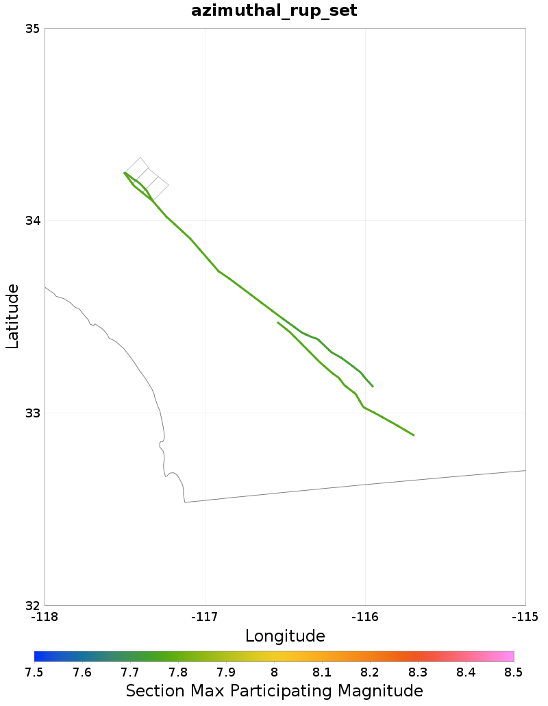 |
|-----|
|  [Download GeoJSON](resources/sect_max_MAG.geojson) |
|  |

### Subsection Maximum Cumulative Jump Dist
_[(top)](#table-of-contents)_

|  |
|-----|
|  [Download GeoJSON](resources/sect_max_CUM_JUMP_DIST.geojson) |
|  |

### Subsection Maximum Cumulative Rake Change
_[(top)](#table-of-contents)_

### Subsection Maximum Cumulative Azimuth Change
_[(top)](#table-of-contents)_

|  |
|-----|
|  [Download GeoJSON](resources/sect_max_CUM_AZ_CHANGE.geojson) |
|  |

